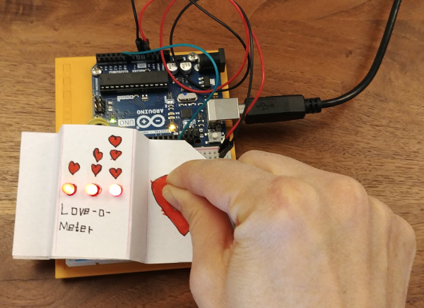

# arduino
Arduino Playground

Alle Projekte wurden mit dem [Arduino Starter](https://store.arduino.cc/genuino-starter-kit) Kit erstellt.

# Meine Projekte
## Projekt 2 Raumschiffsteuerzentrale :rocket:
Der Sourcecode befindet sich hier: [Raumschiffsteuerzentrale](projekt02_raumschiff)

## Projekt 3 Love-o-meter :heart:
Der Sourcecode befindet sich hier: [Raumschiffsteuerzentrale](projekt03_love-o-meter)

[Bild 1 des Arduino Love-o-meter](projekt03_love-o-meter/love-o-meter-1.png)

[Bild 2 des Arduino Love-o-meter](projekt03_love-o-meter/love-o-meter-2.png)

